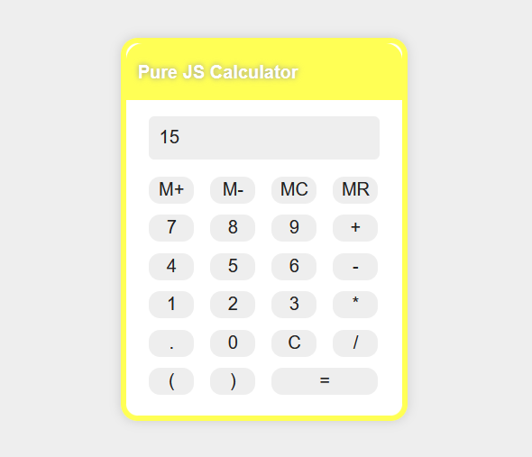

# Simple Pure JS Calculator
#### this has been my first JS training.  I wrote it without any kind of tutorial.   Absolutely there are better ways out there to write a calculator, but this is my way. :)  I am actually using it myself, because it can get multiple mathematical commands together and calculate them in the correct order. Other calculators out there are not like this. 

